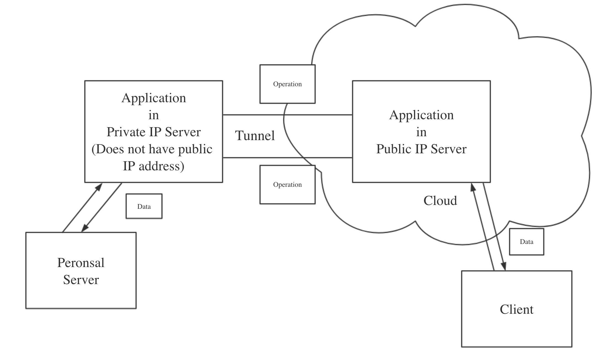

## NAT Travseral Application

#### Introduction
This project is an experimental NAT traversal application, which is used to open a network tunnel to help user connect to their personal server which does not have public IP address.  Only TCP connection will be support in this application, and this application will use packet transfering instead of connection building as a proxy between personal server and public server.  In packet transfering, when application receive data from client/server, it will packet these data as "operation" and transmit this "operation" to the other side.
In the help of this application, user can set up a server at their PC in home, and then they can access this PC server by accessing the server which has public IP.

#### Solving Problem
Nowdays IPv4 address is too full to allocate IP address to each user, more and more users are allocated a inner IP address (Cannot be accessed by outer network client), this application can help users breakthrough the limitation of inner network.

#### Architecture


According to this picture, we can see that on one side, the public server is listening for client, data will be exchanged between client and public server, on the other side, there is a tunnel between public server and private server used to transmit "operation"s, last in the private server, once it receive BUILD_CONNECTION "operation", it will open a connection with the personal server and transmit data between them.

#### Networking Technology
This project used TCP and socket to build connection, so it can only accept TCP connection, because TCP is a connection-orient protocol, we can push data like WebSocket, using these technology, the tunnel will be kept in the network, every data can be push from public server to private server.

#### Concurrency
Because this project need to support multiple clients at the same time, multiple thread has been used in this project, once client connect, the proxy server(both public server and private server) will open a new thread and pass the client_socket as a parameter into the new thread to handle multiple clients at the same time.

#### Libraries
To packet the data as operation, json was used in this project, also, I write down two module call "packet" and "op_enum", "packet" module has one function name packet(), which is use to create a operation packet to transfer to json string, and the "op_enum" stores the enum of operation codes, and operation describtion.
To build a front-end user interface easily, I use flask to manage and receive application registering/unregistering operation, and it can also list the registered application.
To build the front-end index page, ajax was used to build real-time information update at the webpage.

#### What if I have more time?
If I have more time in this project, I will try to fix the bugs and improve the speed(horizontal scale), and also I will try to support some complicate Protocol like UDP, FTP etc..

#### Manual
To run this project, there is two files, one is "proxy_public.py", placed in the server which has public address, the other is "public_private.py", placed in your personal server
How to run "proxy_public.py"(Example):
```
$ python3 proxy_public.py 6300 6301
```
6300 is use to accept the tunnel connection from private server
6301 is the register port, when private server want to send application registering operation, the 6301 port will receive this operation.

How to run 
